# Project: Serverless TODO Application
The project is based on the given environment variables in the **./client/.env** file as below:

```sh
REACT_APP_AUTH0_DOMAIN=dev-qtuqnwt0vs78ouex.us.auth0.com
REACT_APP_AUTH0_CLIENT_ID=XzvuBYqVEwcgIvRNTJe8QsNh1ED65NEZ
REACT_APP_API_ENDPOINT=https://e0yv7aleik.execute-api.us-east-1.amazonaws.com/dev
```
Please copy-paste the above variables to your ***./client/.env*** file

## I. Functionality

1. **The application allows users to create, update, delete TODO items**
  - Get TODO:
   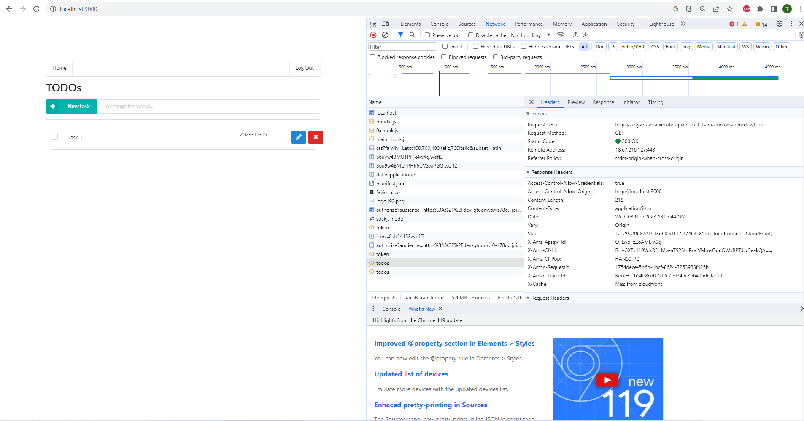

  - Create TODO: 
  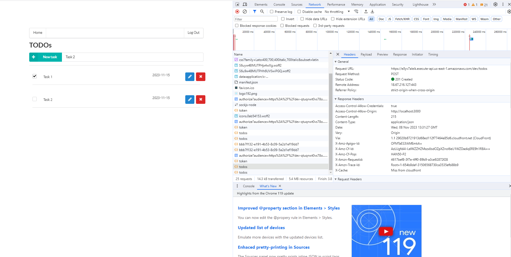

  - Update TODO: 
  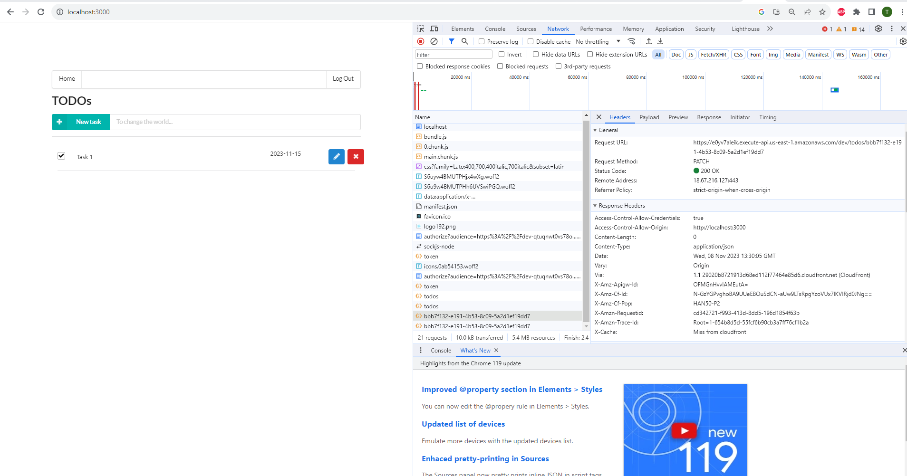

  - Delete TODO: 
  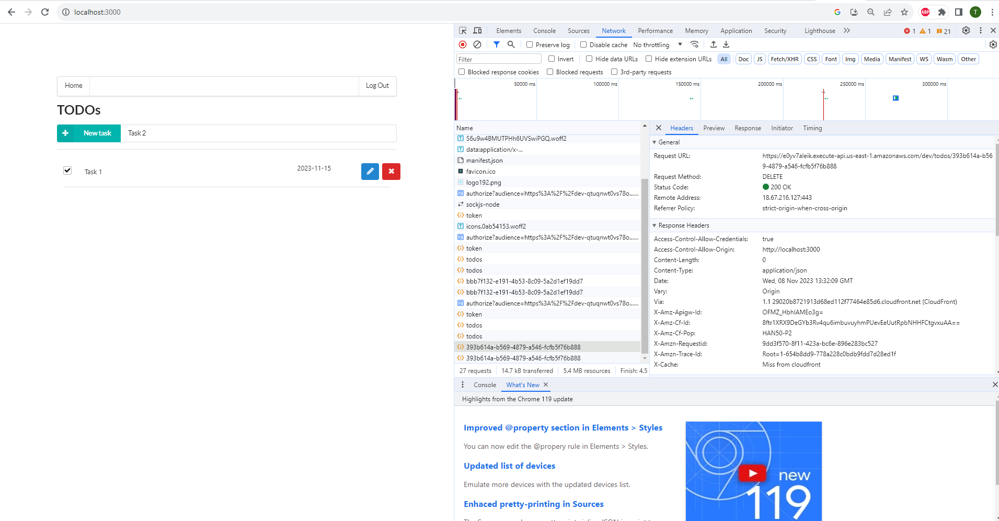


2. **The application allows users to upload a file.**
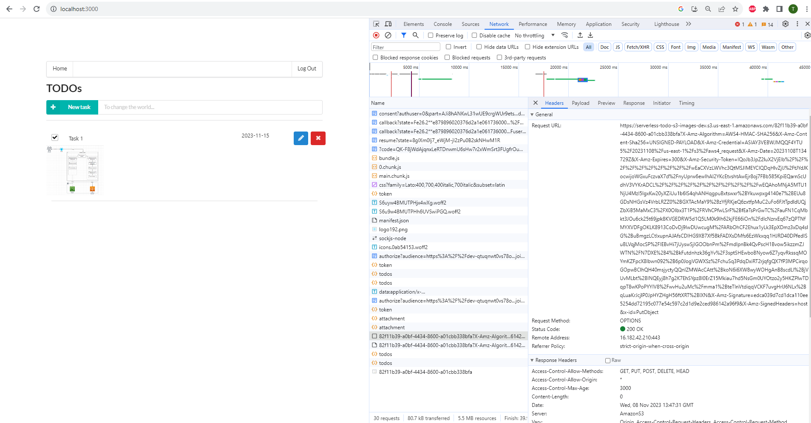

3. **The application only displays TODO items for a logged in user.**
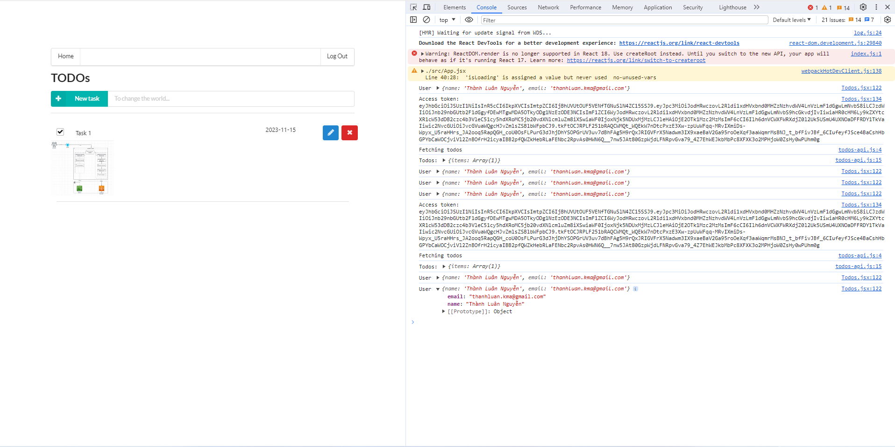

4. **Authentication is implemented and does not allow unauthenticated access.**
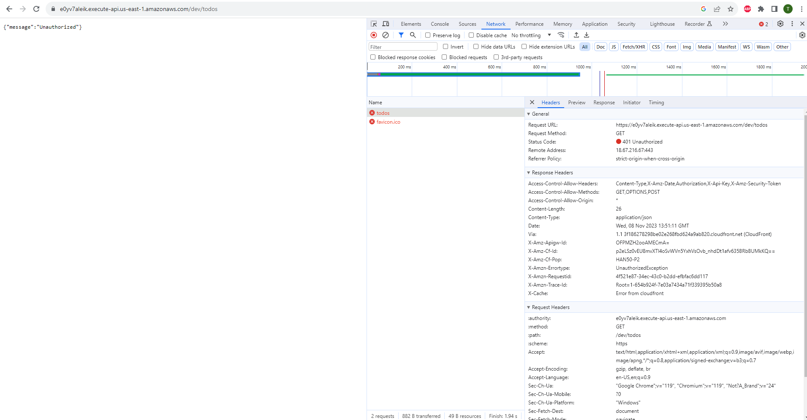

## II. Code Base

1. The code is split into multiple layers separating business logic from I/O related code.
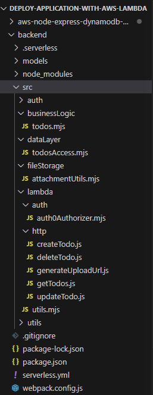

2. Code is implemented using async/await and Promises without using callbacks.

  - My backend source code is implemented with using async/await & promises without using any callback:
  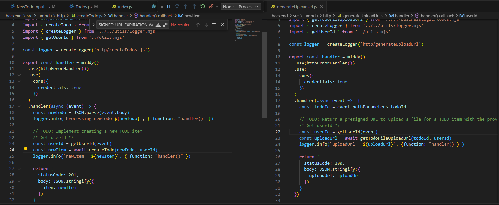


## III. Best Practice

1. All resources in the application are defined in the "serverless.yml" file

  - My backend source code provides all AWS resources via "serverles.yml" file.
  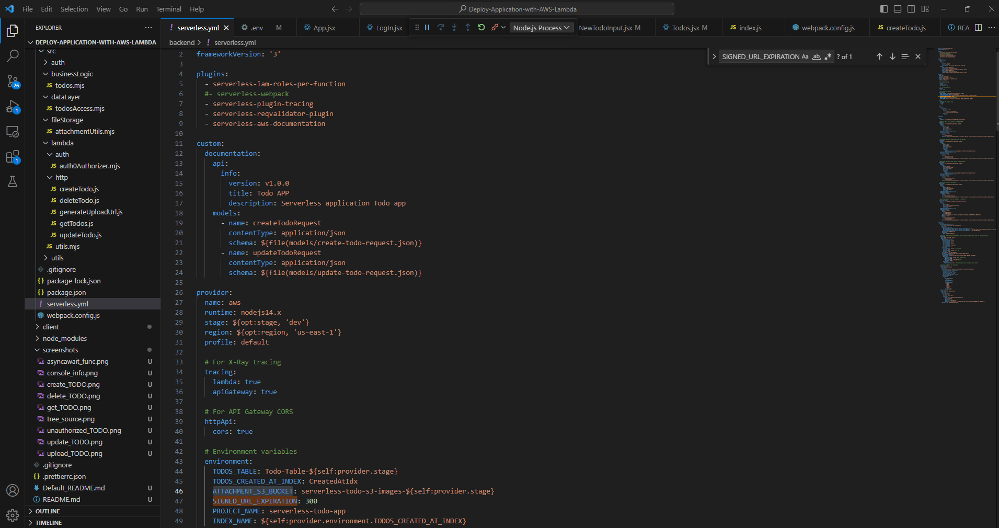

2. Each function has its own set of permissions.

  - Each functions in serverless.yml has own proper sets of permission:
  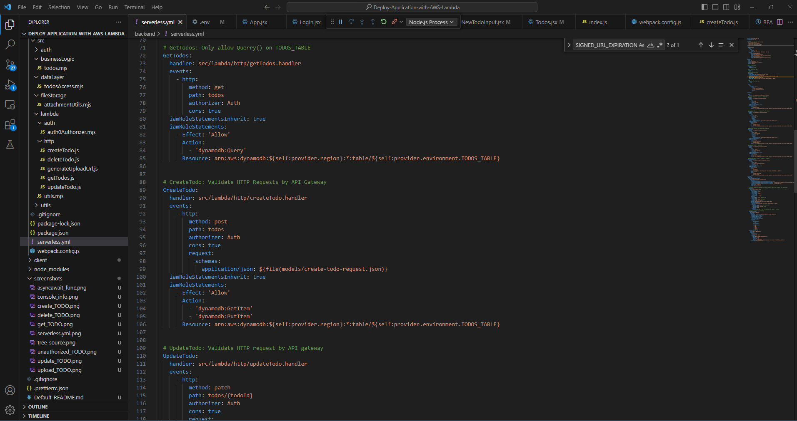


3. Application has sufficient monitoring.
  - Application logs are shown under CloudWatch's log groups with Winston's logs for troubleshooting
  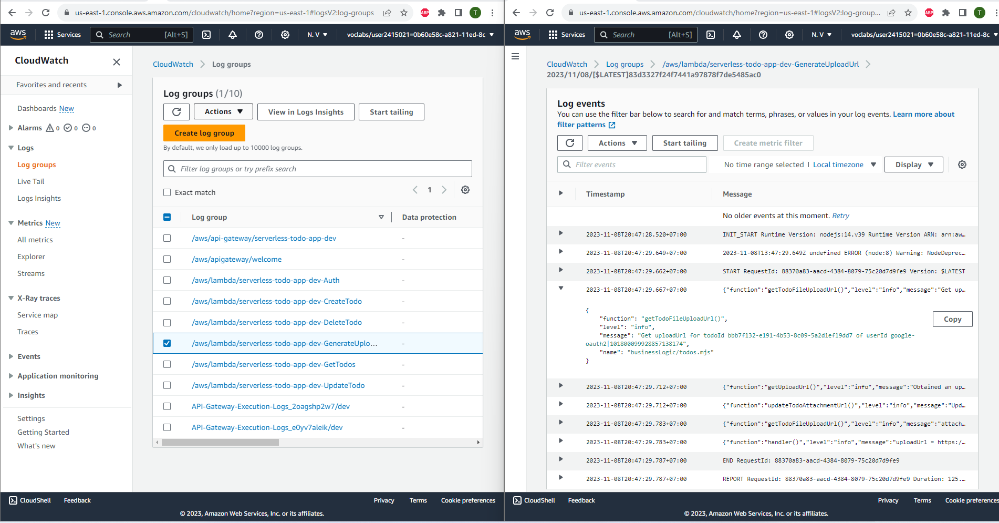

4. HTTP requests are validated
  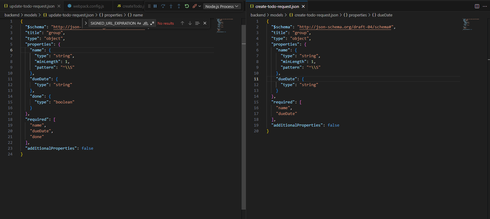


## IV. Architecture

1. Data is stored in a table with a composite key.
  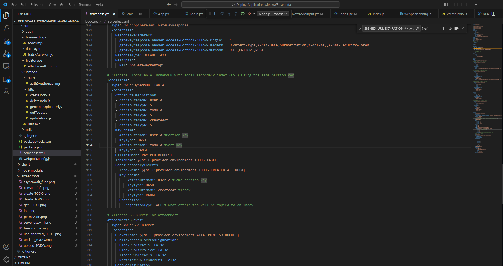

2. Scan operation is not used to read data from a database.
  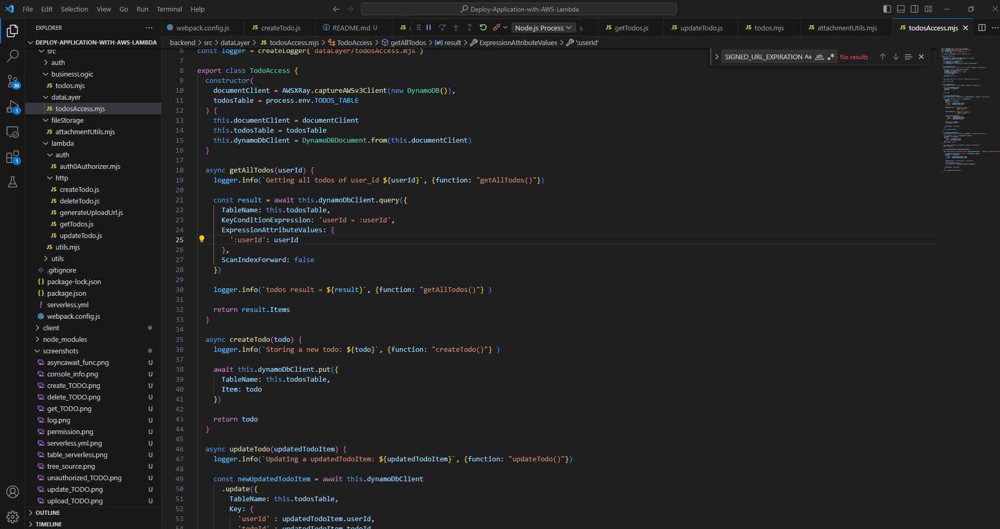
